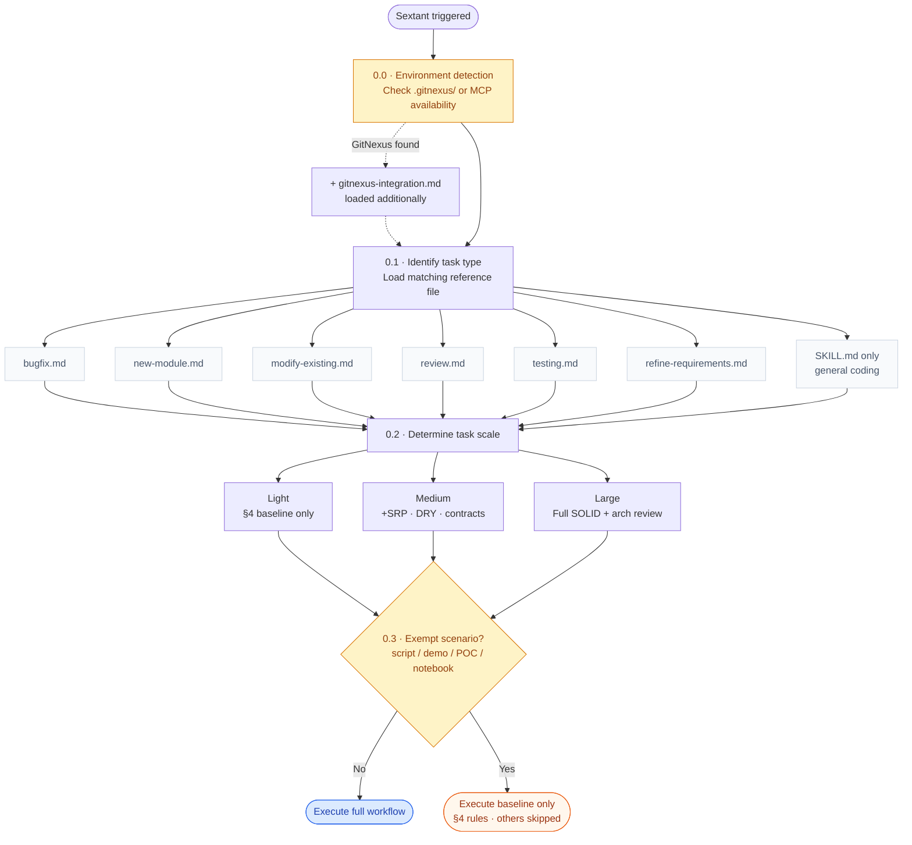

# Sextant

**Architecture-aware engineering principles framework for Claude Code.**

Sextant provides systematic, tiered workflows for common coding tasks — bug fixes, new features, refactoring, code review, test writing, and requirements refinement. Like a nautical sextant that helps navigators fix their exact position before charting a course, it helps Claude understand where it is in the codebase before making changes.

---

## Install

### Via Claude Code Marketplace (recommended)

Inside Claude Code, run:

```
/plugin install https://github.com/hellotern/sextant
```

Once installed, the skill is invoked automatically based on task context, or manually:

```
/sextant:principles
```

### Manual — as a standalone skill (no plugin system)

```bash
git clone https://github.com/hellotern/sextant /tmp/sextant
cp -r /tmp/sextant/skills/principles ~/.claude/skills/sextant
```

---

## How It Works



Sextant operates as a **layered skill system**:

1. **Task Detection** — Identifies the task type (bug fix, new feature, etc.) and loads the corresponding reference workflow
2. **Scale Assessment** — Activates rules proportionally to task size (lightweight / medium / large)
3. **Workflow Execution** — Follows the structured workflow, applying only principles relevant to the current task

### Task Types

| Task Type | Reference File |
|-----------|---------------|
| Bug Fix | `references/bugfix.md` |
| New Feature / Module | `references/new-module.md` |
| Modify / Enhance / Refactor | `references/modify-existing.md` |
| Code Review | `references/review.md` |
| Write Tests | `references/testing.md` |
| Requirements Analysis & Refinement | `references/refine-requirements.md` |

### Rule Scaling

| Scale | Trigger | Active Rules |
|-------|---------|--------------|
| **Lightweight** | Single-function adjustments, config changes, style fixes | Baseline rules only (§4) |
| **Medium** | New functions/classes, module-internal changes, bug fixes | + SRP, DRY, interface contracts |
| **Large** | Cross-module changes, public interface modifications, new modules | Full SOLID + impact analysis + architecture audit |

### Exempt Scenarios (§0.3)

The following bypass most rules (baseline rules §4 still apply):
- One-off scripts / temporary tools
- Demos / prototypes / POCs
- Algorithm problems / competitive programming
- Notebooks / data exploration

---

## Core Principles

### SOLID
- **SRP** — Every module, class, and function has one responsibility and one reason to change
- **OCP** — Open for extension, closed for modification
- **LSP** — Subclasses must be transparently substitutable for their base classes
- **ISP** — Interfaces stay small; implementors are not forced to depend on unused methods
- **DIP** — High-level modules depend on abstractions, not concrete implementations

### Architecture Constraints
- **Hollywood Principle** — Modules declare dependencies (injected); they don't proactively pull them
- **Dependency Direction** — Entry → Logic → Data → Infrastructure (one-way, no reversal)
- **Module Boundaries** — Cross-module communication via public interfaces or event bus only

### Code Quality Baselines (§4 — Always Active)
Never swallow exceptions · No magic numbers or strings · Accurate function naming · Validate parameters at public interfaces · Explicit type declarations · Meaningful log messages · Explicit dependency declaration · Side effects isolated from pure computation

---

## GitNexus Integration (Optional)

> **GitNexus is NOT required.** Sextant works fully without it. When GitNexus is present, certain manual grep/read steps are replaced with precise graph queries — it's a performance accelerator, not a dependency.

[GitNexus](https://gitnexus.dev) indexes your codebase as a knowledge graph and exposes MCP tools. When available, Sextant detects it automatically (§0.0) and activates enhanced mode:

| Manual Approach | GitNexus Enhanced |
|----------------|-------------------|
| Grep for function, read call chain file by file | `context` returns complete caller/callee graph in one call |
| Estimate "what will this change break" | `impact` returns layered impact list with confidence scores |
| `pydeps` / `madge` for circular dependency detection | `impact both` queries the graph, covers all languages |
| Search for similar code to avoid duplication | `query` semantic search + cluster membership |
| Manually review `git diff` impact | `diff_review` analyzes change impact automatically |

To enable: run `npx gitnexus analyze` in your project root. Sextant detects the resulting `.gitnexus/` directory automatically.

---


## File Structure

```
sextant/
├── .claude-plugin/
│   └── plugin.json              # Plugin metadata for Claude Code marketplace
├── skills/
│   └── principles/              # Skill name → invoked as /sextant:principles
│       ├── SKILL.md             # Main skill: task detection, SOLID, DRY, baselines
│       └── references/
│           ├── bugfix.md
│           ├── new-module.md
│           ├── modify-existing.md
│           ├── review.md
│           ├── testing.md
│           ├── refine-requirements.md
│           └── gitnexus-integration.md   # Optional — loaded only when GitNexus is detected
├── README.md
└── LICENSE
```

---

## Design Philosophy

**Principles are tools, not chains.** The goal is the lowest long-term maintenance cost for the team. When principles conflict, that standard is the final arbiter.

**Only activate what the task needs.** A one-line bug fix doesn't need a full architecture audit. Sextant scales its rigor to match the scope of the work.

**Understand before acting.** Every workflow starts with reading and understanding existing code and its context. Changing code without reading it is like rerouting plumbing without a floor plan.

---

## License

MIT — see [LICENSE](LICENSE)
