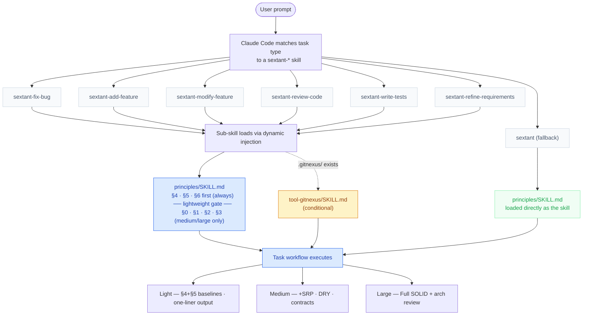

# Sextant

**Architecture-aware engineering principles framework for Claude Code.**

Sextant provides systematic, tiered workflows for common coding tasks — bug fixes, new features, refactoring, code review, test writing, and requirements refinement. Like a nautical sextant that helps navigators fix their exact position before charting a course, it helps Claude understand where it is in the codebase before making changes.

---

## Install

### Option 1: Plugin marketplace

In Claude Code, run:

```
/plugin install sextant@claude-plugins-official
```

Or use `/plugin` to open the interactive plugin manager, navigate to **Discover**, and search for "sextant".

### Option 2: Personal installation (all projects)


```bash
git clone https://github.com/hellotern/sextant.git /tmp/sextant
cp -r /tmp/sextant/skills ~/.claude/skills/sextant
```

### Option 3: Project-level installation (this project only)

```bash
cd /path/to/your/project
git clone https://github.com/hellotern/sextant.git /tmp/sextant
cp -r /tmp/sextant/skills .claude/skills/sextant
```

### Option 4: Team configuration

Add to your project's `.claude/settings.json`:

```json
{
  "extraKnownMarketplaces": {
    "sextant": {
      "source": {
        "source": "github",
        "repo": "hellotern/sextant"
      }
    }
  }
}
```

Skills are available immediately — no restart required.

---

## How It Works

> For an interactive version of the loading flow diagram, see [sextant_loading_flow.html](sextant_loading_flow.html).



Sextant operates as a **layered skill system**:

1. **Skill Matching** — Claude Code identifies the task type (bug fix, new feature, etc.) and loads the corresponding sextant skill
2. **Dynamic Injection** — Each sub-skill dynamically injects the full `principles/SKILL.md` at load time. The file is front-loaded: §4 (baselines) and §5 (anti-pattern detection) appear first, followed by a lightweight task gate — so short tasks stop reading early without needing a separate file
3. **Scale Assessment** — Activates rules proportionally to task size (lightweight / medium / large)
4. **Workflow Execution** — Follows the structured workflow, applying only principles relevant to the current task

### Task Types

| Task Type | Skill | Key behavior |
|-----------|-------|--------------|
| Bug Fix | `sextant-fix-bug` | Disambiguation gate vs modify-feature; surgical minimal-change fix |
| New Feature / Module | `sextant-add-feature` | Full impact analysis before implementation |
| Modify / Enhance / Refactor | `sextant-modify-feature` | Disambiguation gate vs fix-bug; 6-step change strategy |
| Code Review | `sextant-review-code` | **Declares Review-only or Review+patch mode** before reading any code |
| Write Tests | `sextant-write-tests` | Bug-fix entry path for reproduction tests |
| Requirements Analysis & Refinement | `sextant-refine-requirements` | Break down ambiguous requirements before coding |
| General Coding | `sextant` (fallback) | Lightweight tasks and exempt scenarios |

### Rule Scaling

| Scale | Trigger | Active Rules | Output format |
|-------|---------|--------------|---------------|
| **Lightweight** | Single-function adjustments, config changes, style fixes | §4 baselines + §5 anti-pattern flags | One-liner (`✅` / `⚠️`) |
| **Medium** | New functions/classes, module-internal changes, bug fixes | + SRP, DRY, interface contracts | Full summary block |
| **Large** | Cross-module changes, public interface modifications, new modules | Full SOLID + impact analysis + architecture audit | Full summary block |

### Exempt Scenarios

The following bypass most rules (baseline rules §4 still apply):
- One-off scripts / temporary tools
- Demos / prototypes / POCs
- Algorithm problems / competitive programming
- Notebooks / data exploration

---

## Core Principles

### SOLID
- **SRP** — Every module, class, and function has one responsibility and one reason to change
- **OCP** — Open for extension, closed for modification
- **LSP** — Subclasses must be transparently substitutable for their base classes
- **ISP** — Interfaces stay small; implementors are not forced to depend on unused methods
- **DIP** — High-level modules depend on abstractions, not concrete implementations

### Architecture Constraints
- **Hollywood Principle** — Modules declare dependencies (injected); they don't proactively pull them
- **Dependency Direction** — Entry → Logic → Data → Infrastructure (one-way, no reversal)
- **Module Boundaries** — Cross-module communication via public interfaces or event bus only

### Code Quality Baselines (§4 — Always Active)
Never swallow exceptions · No magic numbers or strings · Accurate function naming · Validate parameters at public interfaces · Explicit type declarations · Meaningful log messages · Explicit dependency declaration · Side effects isolated from pure computation

---

## GitNexus Integration (Optional)

> **GitNexus is NOT required.** Sextant works fully without it. When GitNexus is present, certain manual grep/read steps are replaced with precise graph queries — it's a performance accelerator, not a dependency.

[GitNexus](https://gitnexus.dev) indexes your codebase as a knowledge graph and exposes MCP tools. When a `.gitnexus/` directory is detected, each sub-skill automatically injects `tool-gitnexus/SKILL.md` via conditional dynamic injection:

| Manual Approach | GitNexus Enhanced |
|----------------|-------------------|
| Grep for function, read call chain file by file | `context` returns complete caller/callee graph in one call |
| Estimate "what will this change break" | `impact` returns layered impact list with confidence scores |
| `pydeps` / `madge` for circular dependency detection | `impact both` queries the graph, covers all languages |
| Search for similar code to avoid duplication | `query` semantic search + cluster membership |
| Manually review `git diff` impact | `diff_review` analyzes change impact automatically |

To enable: run `npx gitnexus analyze` in your project root. Sextant detects the resulting `.gitnexus/` directory automatically.

---


## File Structure

```
sextant/
├── skills/
│   ├── principles/              # §4·§5·§6 first (always), then §0–§3 (medium/large) — shared source + fallback skill
│   │   └── SKILL.md
│   ├── fix-bug/                 # Bug fix workflow
│   │   └── SKILL.md
│   ├── add-feature/             # New feature workflow
│   │   └── SKILL.md
│   ├── modify-feature/          # Modify/refactor workflow
│   │   └── SKILL.md
│   ├── review-code/             # Code review workflow
│   │   └── SKILL.md
│   ├── write-tests/             # Test writing workflow
│   │   └── SKILL.md
│   ├── refine-requirements/     # Requirements analysis workflow
│   │   └── SKILL.md
│   └── tool-gitnexus/           # GitNexus integration (conditionally injected)
│       └── SKILL.md
├── README.md
└── LICENSE
```

Each task skill dynamically injects the full `principles/SKILL.md` at load time via `` !`awk ... ${CLAUDE_SKILL_DIR}/../principles/SKILL.md` ``. The file is structured so that §4 (quality baselines) and §5 (anti-pattern detection) appear first, followed by an explicit lightweight task gate before the heavier §0–§3 sections (SOLID, DRY, architecture). This means the full principles body is always loaded into context, but short tasks exit early without processing the architecture content. When a `.gitnexus/` directory is detected, `tool-gitnexus/SKILL.md` is also injected. **One skill load = principles (front-loaded) + optional GitNexus + task workflow**.

---

## Design Philosophy

**Principles are tools, not chains.** The goal is the lowest long-term maintenance cost for the team. When principles conflict, that standard is the final arbiter.

**Only activate what the task needs.** A one-line bug fix doesn't need a full architecture audit. Sextant scales its rigor to match the scope of the work.

**Understand before acting.** Every workflow starts with reading and understanding existing code and its context. Changing code without reading it is like rerouting plumbing without a floor plan.

---

## License

MIT — see [LICENSE](LICENSE)
